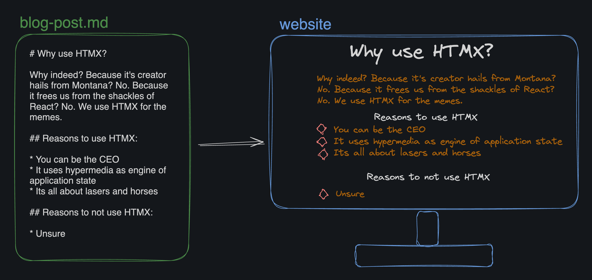

# Static Site Generator

#### From Boot.dev
A static site generator takes raw content files (like Markdown and images) and turns them into a static website (a mix of HTML and CSS files).



#### How To Run Project
In your terminal, clone this repo
    navigate to the cloned folder and run

    ```bash:
    ./main.sh
    ```

#### Test
```bash
./test.sh
```


#### To Use:
Modify the index.md file located in `/content` folder to your taste and ensure markdown files are linked correctly.
Your image files can be added to the `static/images/` folder
Run project as specified above, voila!